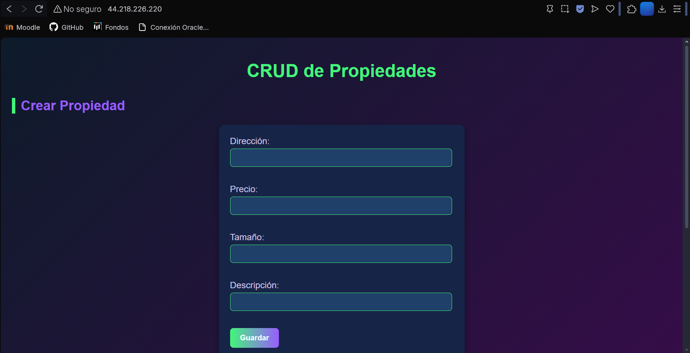
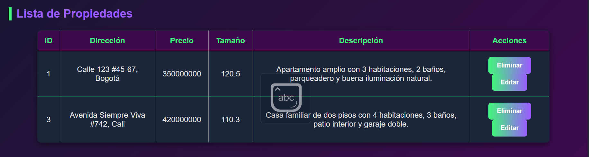
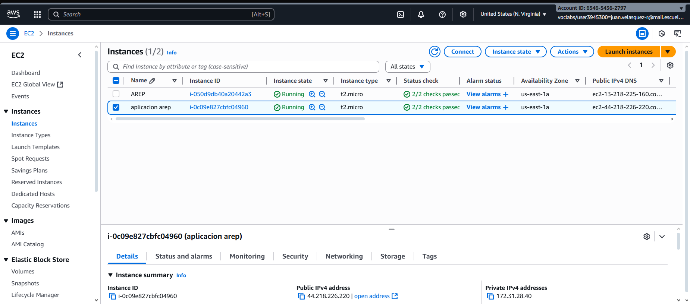
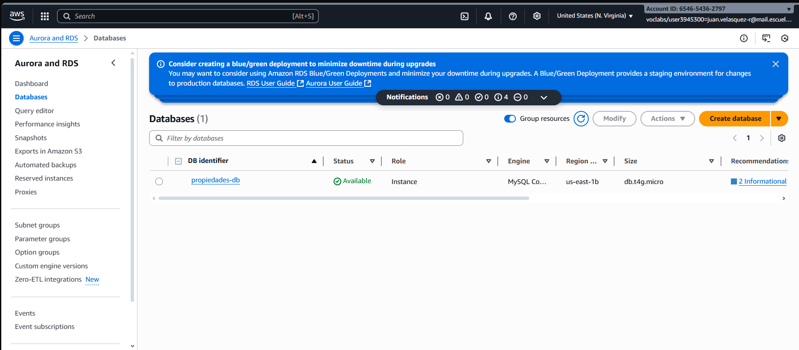
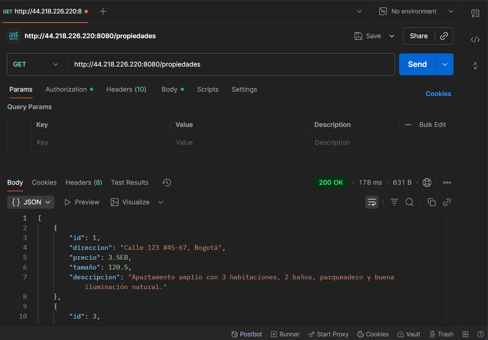
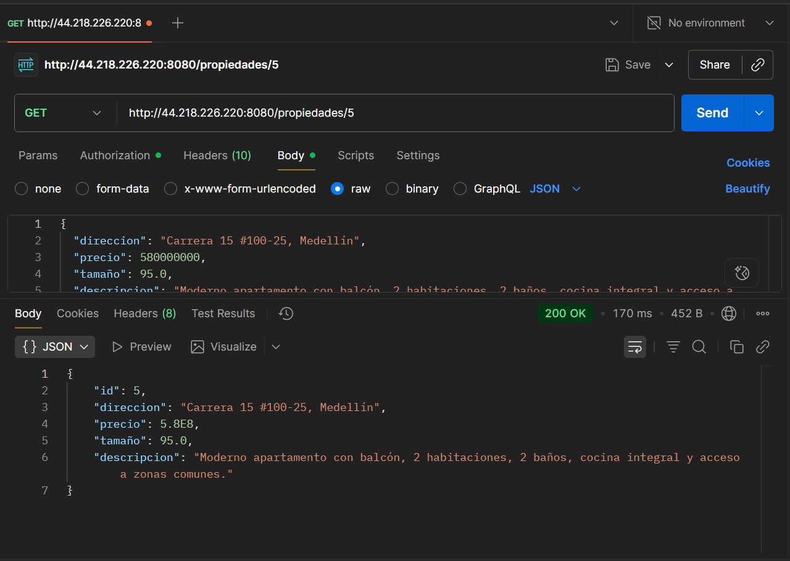
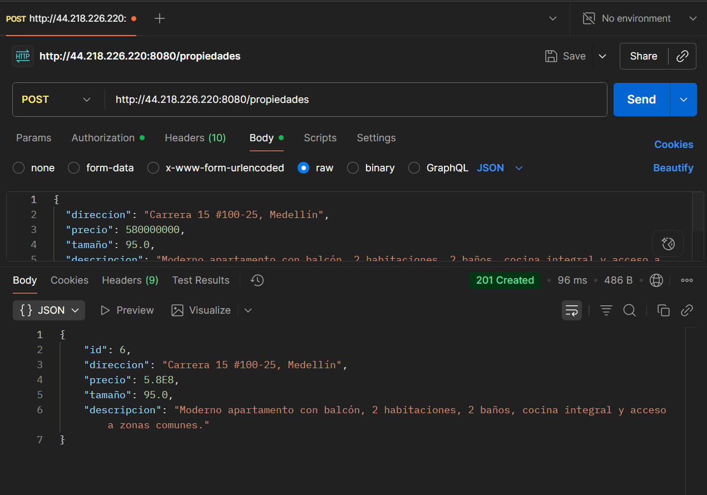
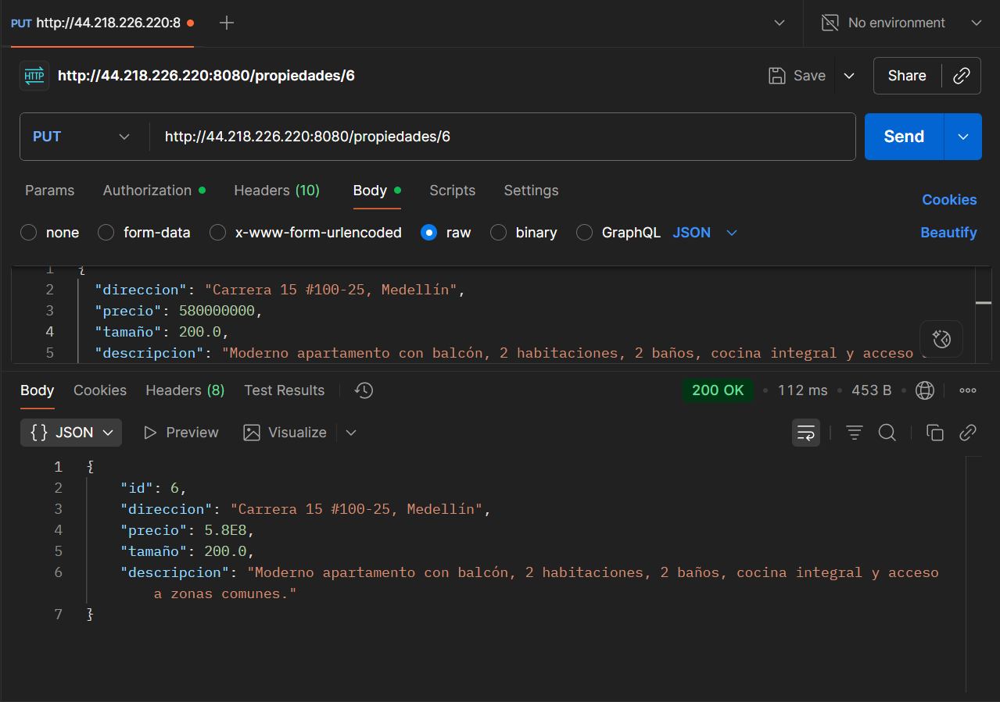
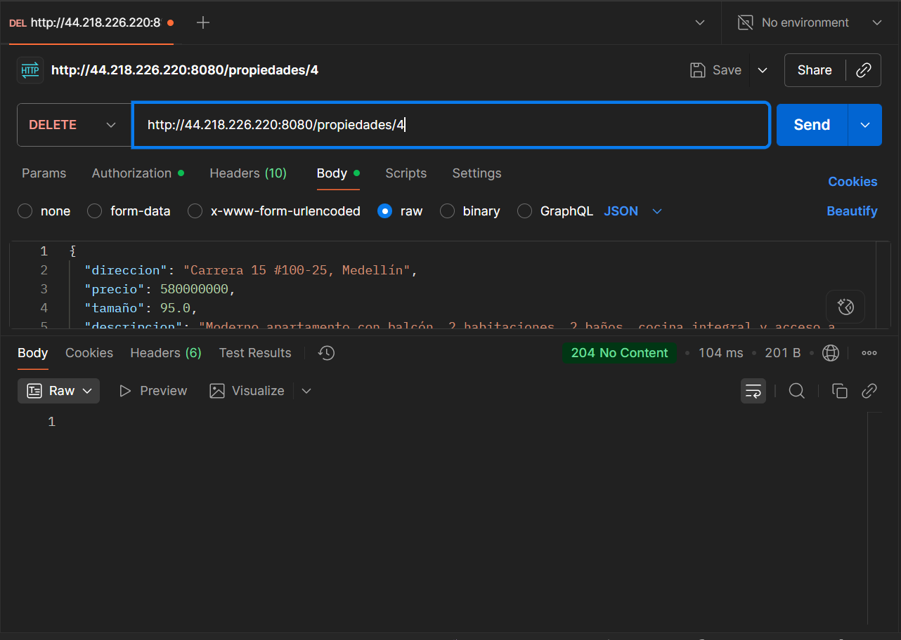

# Property Management System (AREP-Taller5)

## 📌 Project Summary
Este proyecto es un sistema de **gestión de propiedades inmobiliarias**, desarrollado como parte del curso AREP.  
El sistema permite realizar operaciones CRUD (crear, consultar, actualizar y eliminar propiedades) a través de un **backend en Spring Boot**, un **frontend en HTML + JavaScript (AJAX)** y una **base de datos MySQL en AWS RDS**.  

La aplicación fue desplegada en **AWS EC2**, de manera que puede ser accedida de forma remota desde el navegador.

---

## 🏗️ System Architecture

La arquitectura del sistema sigue un esquema **3 capas**:

1. **Frontend**  
   - Implementado con `index.html` y `app.js`  
   - Se comunica con el backend mediante `fetch()` (AJAX).  
   - Permite registrar nuevas propiedades y consultar las existentes.  

2. **Backend**  
   - Framework: **Spring Boot 3**  
   - Expone una API REST en `/propiedades`.  
   - Controlador: `PropiedadController`  
   - Servicio: `PropiedadService`  
   - Repositorio: `PropiedadRepository` (Spring Data JPA).  

3. **Database**  
   - Motor: **MySQL en AWS RDS**  
   - Base de datos: `propiedades-db`  
   - Tabla: `propiedades`  
   - Manejada automáticamente por **Hibernate/JPA**.

📌 **Interacción general**:  
Frontend → API REST (Spring Boot) → MySQL (AWS RDS)

---

## 📂 Clases

Las clases principales del sistema son:

- **`Propiedad` (Entidad JPA)**  
  Representa una propiedad inmobiliaria con atributos como dirección, precio, tamaño y descripción.

- **`PropiedadRepository` (Repositorio)**  
  Interfaz que extiende `JpaRepository` para manejar consultas a la base de datos.

- **`PropiedadService` (Servicio)**  
  Contiene la lógica de negocio para crear y consultar propiedades.

- **`PropiedadController` (Controlador)**  
  Expone los endpoints REST `/propiedades` para interacción con el frontend.

## Diagramas

### Diagrama de clases


### 🌐 Diagrama de Infraestructura

---

## 🚀 Deployment Instructions

### 1. Configuración local
1. Clonar el repositorio.  
2. Crear archivo `application.properties` dentro de directorio /resources con credenciales de RDS:
   ```properties
   spring.application.name=arep
   spring.datasource.url=jdbc:mysql://<ENDPOINT_RDS>:3306/propiedades-db
   spring.datasource.username=admin
   spring.datasource.password=<PASSWORD>
   spring.jpa.hibernate.ddl-auto=update
   spring.jpa.show-sql=true
   spring.jpa.database-platform=org.hibernate.dialect.MySQLDialect
3. Construir el proyecto con Maven:
   ```
   mvn clean package
## 🛠️ Despliegue en AWS

1. EC2: Crear una instancia Ubuntu y abrir puertos 22 (SSH), 8080 (backend) y 80 (frontend).
2. Asignar una IP elástica a la instancia de EC2, para este caso
   
   ```44.218.226.220```
3. Copiar el .jar al servidor:
   ```
   scp -i clave.pem target/arep-0.0.1-SNAPSHOT.jar ubuntu@<IP_PUBLICA>:/home/ubuntu/
4. Ejecutar el backend
   ```
   java -jar arep-0.0.1-SNAPSHOT.jar
   ```
   Queda disponible en 
   http://44.218.226.220:8080/propiedades
5. Copiar archivos estáticos de local al servidor
   ```
   scp -i clave.pem -r frontend/ ubuntu@44.218.226.220:/home/ubuntu/frontend/
   ```

6. Instalar nginx para servir el frontend
   ```
   sudo apt update
   sudo apt install nginx -y
   sudo mv frontend/* /var/www/html/
   sudo systemctl restart nginx
   ```
7. Finalmente el front queda servido en http://44.218.226.220 y consume el back en http://44.218.226.220:8080/propiedades

## 📈 Evidencias del funcionamiento
- Front en funcionamiento desde la ip elástica de EC2



- Instancia en ejecución


- Base de datos disponible


### Pruebas desde postman
- Obtener todas las propiedades

- Obtener propiedad por id

- Crear una propiedad

- Actualizar una propiedad

- Eliminar una propiedad


### Video de prueba
[Video probando el despliegue](https://drive.google.com/uc?id=1PQOV73NgQK5Rlv8t8ItOr3YzI_71Gypt&export=download)
